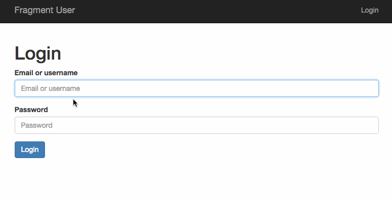

# fragments user clientside \[WIP\]

[ROADMAP](https://github.com/snd/fragments-user-clientside/issues/1)

[a log of pitfalls, limitations and things to be aware off](log.md)

**constructive feedback is very welcome : ) [don't hesitate to open an issue !](https://github.com/snd/fragments-user-clientside/issues/new)**

a client side for [fragments-user](https://github.com/snd/fragments-user)
as the driver for designing (experimenting with)
a clientside application combining
[hinoki](https://github.com/snd/hinoki),
[react](http://facebook.github.io/react/),
[cursors](https://github.com/caseywebdev/cursors)
and other technologies
as the base for future production client side applications.

gone through several iterations. it's still in flux but its getting there.

- isomorphic
- extremely DRY across client and server
- clientside dependency injection gives just enough structure to clientside applications
- effortless sharing of dependencies between server and client
- super simple but powerful routing (let react and cursors do most of the work)
- cursors
- ...



## relevant files and folders

- [gulpfile.coffee](gulpfile.coffee) - builds `static/app.js`
  from various .js files contained in bower-components specified in [src/server/assets.coffee](src/server/assets.coffee),
  from [src/client-first.coffee](src/client-first.coffee),
  from [src/shared](src/shared),
  from [src/client](src/client),
  and finally from [src/client-last.coffee](src/client-last.coffee)
- [src/client](src/client) - client only hinoki factories
  - [src/client/init.coffee](src/client/init.coffee) - **CLIENTSIDE ENTRY POINT**
  - [src/client/history.coffee](src/client/history.coffee) - utilities for dealing with the current-url-cursor-sync
- [src/client-first.coffee](src/client-first.coffee) - first part of the concatenated `static/app.js`. mocks `module.exports` such that factory files can just be concatenated after it.
- [src/client-last.coffee](src/client-last.coffee) - last part of the concatenated `static/app.js`. starts dependency injection with the factories in `module.exports` and calls dependency `initClient`.
- [src/shared](src/shared) - client-server hinoki factories
  - [src/shared/component.coffee](src/shared/component.coffee) - react components
  - [src/shared/router.coffee](src/shared/router.coffee) - a very simple router that uses [url-pattern](https://github.com/snd/url-pattern). for clientside use mostly.
- [src/server](src/server) - server only hinoki factories
  - [src/server/server.coffee](src/server/server.coffee) - **SERVERSIDE ENTRY POINT**
- [app](app) - executable command line runner for [fragments](https://github.com/snd/fragments) app. sources [src/server](src/server) and [src/shared](src/shared)
- [bower.json](bower.json) - bower dependencies. only files in
  [src/server/assets.coffee](src/server/assets.coffee) are picked.
- [sass](sass) - sass that is compiled into `static/public.css`
- [sass/public.sass](sass/public.sass) - **SASS ENTRY POINT**

## conventions

- pull in `window` and  `document` through the dependencies instead of relying on globals. the latter are difficult to test.
- each react component name is camelcased and starts with `Component`
- each page component corresponds to one path (url pattern)
- all component local state must be connected to the root cursor state
  - the UI must be kept a pure function mapping state to DOM
- be frugal with component helpers
  - extract common patterns into functions and give them descriptive names
- CSS/SASS
  - each react components outermost tag/element has a class with the component name for easy and consistent component styling
  - style components using mixins
  - use sass to extend bootstrap styles in [sass/public.sass](sass/public.sass)
- we use cookies only for the storage of the token in the browser.
  we ignore cookies on the server.
- a component must take all data that its rendering depends on via cursors
  from parent components.
- pass in the root cursor into "special" components like `ComponentRoot`,
  `ComponentRouter`, `ComponentLoadCurrentUser`, `ComponentNavigation`
    - maybe even in page components
- pass in specialized cursors into all other components
- get a cursors through props if the components render depends to cursor and it should only update when the data the cursor is pointing at changes
- get a cursor through dependency injection ONLY if the component ONLY updates that cursor

## state tree and cursors

- `path` the current path in the browser url bar (example: `/login`).
  update to navigate.
- `currentUser` the currently logged in user. `null` if no user is logged in.
  - `id`
  - `email`
  - `name`
  - `rights`
- `page` **the single place** for the currently mounted page component to put its working state.
  it is a page components responsibility to clear this on mount.
  [this subtree is documented per-component in detail here.](#page-state)
- `error` if present a modal with this error message is overlaid.
  dismissing that modal clears this.

## page state

- `ComponentLogin`
  - `data` form data
    - `identifier`
    - `password`
  - `errors` errors for form data
    - `identifier`
    - `password`
  - `alert` error message that, if present, is shown above the form

## instructions on getting it to run

```
npm install -g gulp-cli
npm install -g bower
gem install sass
```

```
cd {this-repository}
```

```
npm install
```

configure by changing [.env](.env) to suit your needs.

```
source .env
```
(or use [autoenv](https://github.com/kennethreitz/autoenv) which is recommended)

create database thats in env var `DATABASE_URL`:
```
./app pg:create
```

migrate:
```
./app pg:migrate
```

compile development javascript:
```
gulp copy-fonts
gulp dev-js
gulp dev-css
```

start the server:
```
./app serve
```

insert a user so you can actually login and use the clientside app:
```
./app users:insert max max@example.com opensesame
```

give the user some rights:
```
./app rights:insert 1 canGetUsers
```
`1` is the id of the user.

add some fake users to play around with:
```
./app fake:users 100
```

visit `localhost:{the-port-you-put-into-.env}`

## [license: MIT](LICENSE)
